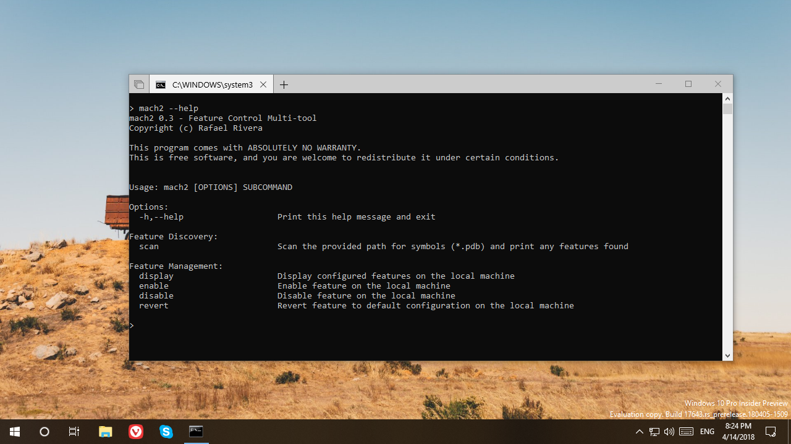

# Mach2

*Mach2* manages the Windows Feature Store, where Features (and associated on/off state) live. This store lives in the undocumented Windows Notification Facility (WNF), which provides publish-subscribe messaging for kernel components, system services, and user-space applications.

Windows currently contains **thousands** of Feature switches that turn on and off new and unfinished functionality, mitigations, test hooks, and overrides. *Mach2* provides facilities to discover these switches and turn them on or off.

Without going into specifics, *Mach2* commands generally fall into one of two buckets:

### Scanning
*Mach2* operates on Feature IDs for the bulk of its operations. But finding interesting Features to turn on and off can be a chore, so it includes a scanning function. This function scans Microsoft Program Database (PDB) files for Feature symbols and collects them for review. A user can then review the results and cherry pick which Features warrant further investigation.

### Management
*Mach2* can dump the current Feature Control store and resolve known IDs to names for convienence. (It reads simple key:value pairs from `features.txt` on disk.)

With a Feature ID in hand, *Mach2* can *enable* or *disable* a Feature on the local system. Both of these actions create configuration state for the Feature and set the feature to *Enabled* or *Disabled* respectively. The user can also choose to *Revert* back to the default configuration -- that is, let the Feature turn itself on or off as desired. (There is a *Default* configuration state that could be set, the tool currently opts to remove reverted features from the configuration store altogether.)

While the tool can manipulate Feature states, the Feature itself drives state compliance. That is, it can choose to ignore its configured state. Various factors, including what's referred to internally as a *staging* configuration, can dictate whether a Feature respects its configurable state or not. (*Always Disabled* staged Features, for example, are crippled/stripped during Windows build compilation and cannot be turned on with Feature Control.)

## Install
Installation is not required, however *Mach2* utilizes registration-free COM activation to bring in DIA SDK components so `msdia120.dll` must be present.

## Building from source

Compilation requires Visual Studio 2017 or newer, a recent version of the Windows 10 SDK installed, [and vcpkg](https://docs.microsoft.com/en-us/cpp/build/install-vcpkg).

### Step-by-step
1. `vcpkg --feature-flags=manifests install` in the mach2 root folder
2. Open `mach2.sln` in Visual Studio
3. Change the target platform and configuration as needed
4. Build

## Usage
*Mach2* relies on [CLI11](https://github.com/CLIUtils/CLI11) to provide a canonical command line argument-driven interface. It's recommended you run the tool with `--help` for details on how to use the tool.

## Testimonials

### Microsoft

<blockquote class="twitter-tweet" data-lang="en">
Please never use this tool. The ways in which it can hose your system (and also defeat the purpose of WIP) are myriad.
&mdash; Brandon Paddock (@BrandonLive) <a href="https://twitter.com/BrandonLive/status/1012145159104954368?ref_src=twsrc%5Etfw">June 28, 2018</a> <a href="https://web.archive.org/web/20180628053245/https://twitter.com/BrandonLive/status/1012145159104954368">(archived)</a></blockquote>

<blockquote class="twitter-tweet" data-conversation="none" data-lang="en">
You can cite me saying this. Hacking around in internal system state you don’t understand is very risky, and creates an inconsistent state that shouldn’t normally be possible. Plus mucks up data and wastes people’s time.
&mdash; Brandon Paddock (@BrandonLive) <a href="https://twitter.com/BrandonLive/status/1012163763204583425?ref_src=twsrc%5Etfw">June 28, 2018</a> <a href="https://web.archive.org/web/20180628051527/https://twitter.com/BrandonLive/status/1012163763204583425">(archived)</a></blockquote>

<blockquote>
[...] Sharing this information is a severe offense and a direct violation of the Windows Insider MVP program and our Windows product [...]

  
&mdash;Windows Insider MVP representative, ~October 14, 2023</blockquote>

## Contributions
Contributions are greatly appreciated. Keep the license in mind (GPLv3).

Try to ping me in advance if you're working on any major changes to ensure we don't clash.
